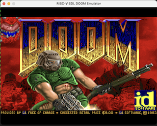

# RV32IMA RISC-V Emulator

A high-performance RISC-V RV32IMA instruction set emulator with SDL graphics support, capable of running DOOM and other graphical applications.

## Features

- **Full RV32IMA Support**: Complete implementation of RISC-V 32-bit base integer (I), multiply/divide (M), and atomic (A) instruction sets
- **Multiple Build Targets**:
  - `rv32ima` - Basic console emulator
  - `rv32ima-sdl` - SDL-enabled emulator for graphical applications
  - `rv32ima-gui` - Debug GUI with ImGui interface
- **DOOM Support**: Run the classic DOOM game on bare-metal RISC-V
- **High Performance**: Optimized C++ implementation
- **Debugging Support**: Optional instruction trace and GUI debugger

## Quick Start

### Prerequisites

```bash
# macOS
brew install sdl2 riscv64-unknown-elf-gcc

# Ubuntu/Debian  
sudo apt-get install libsdl2-dev gcc-riscv64-unknown-elf

# Arch Linux
sudo pacman -S sdl2 riscv64-elf-gcc
```

### Building the Emulator

```bash
# Basic emulator (console only)
make emulator

# SDL-enabled emulator (for DOOM and graphics)
make emulator-sdl

# Debug GUI version
make emulator-gui
```

### Running DOOM

```bash
# Build and run DOOM (one command)
make run-doom

# Or step by step:
make emulator-sdl     # Build SDL emulator
make doom            # Build DOOM binary
./rv32ima-sdl -f src_doom/riscv/doom-riscv.bin -c 800000000
```



### Hello World Example

Create `hello.S`:
```asm
.section .text
.global _start

_start:
    # Print "Hello, World!\n"
    li a7, 64           # sys_write
    li a0, 1            # stdout  
    la a1, msg          # buffer
    li a2, 14           # length
    ecall
    
    # Exit
    li a7, 93           # sys_exit
    li a0, 0            # exit code
    ecall

.section .data
msg:
    .ascii "Hello, World!\n"
```

Build and run:
```bash
# Assemble
riscv64-unknown-elf-as -march=rv32ima -mabi=ilp32 hello.S -o hello.o

# Link
riscv64-unknown-elf-ld -m elf32lriscv -Ttext=0x80000000 hello.o -o hello.elf

# Convert to binary
riscv64-unknown-elf-objcopy -O binary hello.elf hello.bin

# Run
./rv32ima hello.bin
```

## Project Structure

```
rv32-sim/
├── rv32ima_base.cc      # Main emulator implementation
├── rv32ima_core.h       # Core emulator definitions
├── rv32ima_sdl.h        # SDL framebuffer support
├── rv32ima_gui.cc       # ImGui debug interface
├── Makefile             # Build system
├── src_doom/            # DOOM source code
│   ├── riscv/          # RISC-V specific code
│   │   ├── start.S     # Boot code
│   │   ├── i_video.c   # Video driver
│   │   └── ...
│   └── *.c             # DOOM game source
├── tests/               # Test programs
└── gui/imgui/          # ImGui library for debugger
```

## Emulator Options

### rv32ima / rv32ima-sdl

```bash
./rv32ima [options] program.bin

Options:
  --trace         Enable instruction trace output
  --sdl           Enable SDL framebuffer (rv32ima-sdl has this by default)
  -c <cycles>     Maximum cycles to execute
  -f <file>       Binary file to load
```

### rv32ima-gui

The GUI debugger provides:
- Real-time register view
- Memory inspection
- Breakpoint support
- Instruction stepping
- Performance metrics

## Memory Map

| Address Range | Description |
|--------------|-------------|
| 0x80000000 - 0x83FFFFFF | RAM (64MB) |
| 0x10000000 | UART (console I/O) |
| 0x11100000 - 0x111E1000 | Framebuffer (640x480x32) |
| 0x11004000 | Timer |

## Building from Source

### Complete Build

```bash
# Clone repository
git clone https://github.com/yourusername/rv32-sim.git
cd rv32-sim

# Build everything
make all-targets

# Run tests
make test
```

### DOOM Controls

When running DOOM:
- **Arrow Keys**: Move/Turn
- **Ctrl**: Fire  
- **Space**: Use/Open doors
- **Shift**: Run
- **Tab**: Map
- **ESC**: Quit emulator

## Performance

The emulator achieves:
- ~50-100 MIPS on modern hardware (console mode)
- ~30-50 MIPS with SDL framebuffer
- Sufficient performance to run DOOM at playable speeds

## Testing

Run the RISC-V compliance test suite:

```bash
make test
# or
./run_tests.sh
```

## Troubleshooting

### SDL Issues

If SDL is not found:
```bash
# macOS
export CPATH=/opt/homebrew/include:$CPATH
export LIBRARY_PATH=/opt/homebrew/lib:$LIBRARY_PATH

# Linux
sudo apt-get install libsdl2-dev
```

### DOOM Won't Start

1. Ensure you have the DOOM WAD file:
```bash
ls -la src_doom/riscv/doom1.wad
```

2. Check binary size:
```bash
ls -lh src_doom/riscv/doom-riscv.bin
# Should be ~4.5MB
```

3. Increase cycle count if needed:
```bash
./rv32ima-sdl -f src_doom/riscv/doom-riscv.bin -c 1000000000
```

## Contributing

Contributions are welcome! Please ensure:
- Code follows existing style
- Tests pass (`make test`)
- Documentation is updated

## License

This project contains multiple components:
- Emulator: MIT License
- DOOM: GPL v2 (id Software)
- ImGui: MIT License

## Acknowledgments

- Based on mini-rv32ima by CNLohr
- DOOM port adapted from doomgeneric
- RISC-V Foundation for the ISA specification
- ImGui by Omar Cornut for the debug interface

## Contact

For issues and questions, please use the GitHub issue tracker.